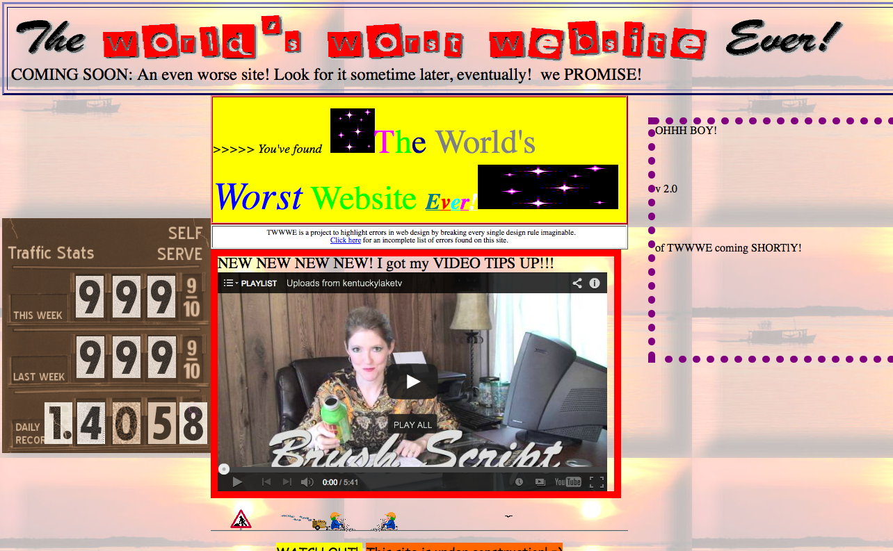

<section>
CSS
===
</section>

<section>

<section>
What is CSS
-----------
**C**ascading **S**tyle **S**heets

the *beautiful* skin atop HTML
</section>

<section>
[](http://www.theworldsworstwebsiteever.com/)
</section>

<section>
[](http://www.polygon.com)

http://designm.ag/wp-content/inspiredology/2012/11/Polygon_main.jpg
</section>
</section>

<section>
CSS in the Wild
---------------
tweak css values for a website using Inspector

fire up inspector, or <span class="key">Ctrl</span>+<span class="key">Shift</span>+<span class="key">C</span>, click on something, and see the sidebar
</section>

<section>
3 ways of defining css
----------------------
1. inline
2. `<style>` tag
3. external stylesheet
</section>

<section>
### `background-color`
most obvious style change
``` html
<body style="background-color: #dddddd">
```
</section>

<section>
### we need a logo!
``` html
<div>IMPRESSIVE LOGO</div>
```
</section>

<section>
### wrap it all in a `header` for convenience
``` html
<header>
  <!-- logo goes here -->
  <!-- nav goes here -->
</header>
```
</section>

<section>
### `text-align: center` to center logo
``` html
<div style="text-align: center;">
  IMPRESSIVE LOGO
</div>
```
</section>

<section>
### `text-align: center` to center navigation links
``` html
<ul style="text-align: center">
```
</section>

<section>
### urgh, bullet points
``` html
<ul style="text-align: center; list-style-type: none;">
```
</section>

<section>
### side-by-side links
``` html
<li style="display: inline-block;"> <a href="#details">Details</a> </li>
<li style="display: inline-block;"> <a href="#installation">Installation</a> </li>
<li style="display: inline-block;"> <a href="#creators">Creators</a> </li>
```
</section>

<section>
Style tags and selectors
------------------------
Styling individual elements is tedious
</section>

<section>
### create `style` tag in `head`
``` html
<!-- in head -->
<style>
</style>
```
</section>

<section>
### `body` to select html tags
``` html
body {
  background-color: #dddddd;
}
```
</section>

<section>
### `.class` to select class
``` html
.logo {
  color: #90a150
}
```
</section>

<section>
### `ul` to style lists
``` html
ul {
  list-style-type: none;
}

li {
  display: inline-block;
  margin-left: 1em;
}
```

yucks!
</section>

<section>
### use `nav ul` selector to be more precise, or give a `class` to the nav
``` html
nav ul {
  list-style-type: none;
}
nav ul li {
  display: inline-block;
}
```
</section>

<section>
### float, box model, clearing
we want logo to be beside the links, use `float` to ask browser to
squeeze them on the same line
``` html
.logo {
  float: left;
  font-size: 3em;
}

nav ul {
  float: right;
  list-style-type: none;
}
```
</section>

<section>
### messed up layout
use a `clear: both` on `div.content` to clear it away

``` html
.content {
  clear: both;
}
```
</section>

<section>
### margin
our links seem to be too close together, use `margin-left` to give it space
``` html
nav ul li {
  display: inline-block;
  margin-left: 1em;
}
```
</section>

<section>
### padding
our content looks like they are too close to the edges of the page

wrap everything in a `div.container`, set `padding-top: 3em`
``` html
.container {
  padding-top: 3em;
}
```
</section>

<section>
### fonts
make impressive logo bigger using `font-size`

``` html
.logo {
  color: #90a150;
  float: left;
  font-size: 3em;
}
```

`text-align` has no more use now that it's floated, remove it
</section>

<section>
### shorthands for `font`
``` html
nav ul {
  float: right;
  list-style-type: none;
  font-size: 1.3em;
  font: 1.3em sans-serif;
}
```
</section>

<section>
### Webfonts
[Google Web Fonts](http://www.google.com/fonts)
``` html
<link href='http://fonts.googleapis.com/css?family=PT+Sans' rel='stylesheet' type='text/css'>
font-family: 'PT Sans', sans-serif;
```
</section>

<section>
### centering everything
set a `width` for `.container` or a `max-width`
``` html
.container {
  margin: 0px auto;
  max-width: 760px;
  padding-top: 3em;
}
```
</section>

<section>
### Pseudo selectors
introducing `a:link`, `a:hover`, `a:visited`
``` html
a:link {
  color: #839e24;
  text-decoration: none;
  border-bottom: 0.14em dotted #839e24;
}

a:hover {
  color: #303030;
  background: #b1d641;
  border-bottom: none;
}
```

there's a lot more, such as `n-th child`, explore on your own
</section>

<section>
References
----------
[Detailed reference on all CSS properties](https://developer.mozilla.org/en-US/docs/Web/CSS/Reference)

[Google Web Fonts](http://www.google.com/fonts)
</section>

